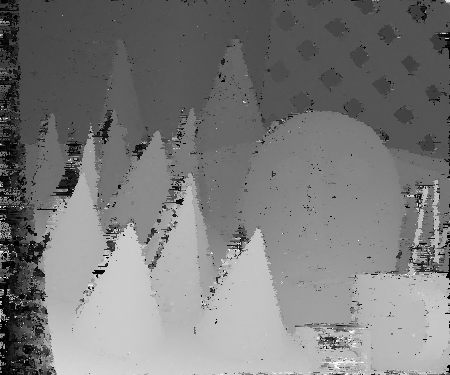

# patchmatch

patchmatch以及patchmatchstereo算法的python版实现

- patchmatch参考 [github](https://github.com/MingtaoGuo/PatchMatch)
- patchmatchstereo参考李迎松博士的c++版[代码](https://github.com/ethan-li-coding/PatchMatchStereo)

由于patchmatchstereo没有做任何优化，并且是python的代码，主要是方便解析算法的原理构造，适合跑小图，patch_size尽量小一些。

## 使用

```python
python patchmatchstereo.py
```

patch_size=5, n_iter=3 结果

```
| Initialize memory cost 0.002 seconds.
| Initialize parameters cost 7.834 seconds.
| Initialize gray cost 4.167 seconds.
| Initialize gradient cost 2.902 seconds.
| Initialize cost 140.518 seconds.
| Initialize cost 9.439 seconds.
| Propagation iter 0 cost 2033.533 seconds.
| Propagation iter 0 cost 1755.244 seconds.
| Propagation iter 1 cost 1753.473 seconds.
| Propagation iter 1 cost 1764.548 seconds.
| Propagation iter 2 cost 1839.081 seconds.
| Propagation iter 2 cost 1751.648 seconds.
| Propagation cost 10897.527 seconds.
| Plane to disparity cost 1.132 seconds.
| LR check cost 2.028 seconds.
| Fill holes cost 1.012 seconds.
| Total match cost 10916.557 seconds.
| Get disparity map cost 0.004 seconds.
| Get disparity cloud cost 24.264 seconds.
```

<p float="left">
    
</p>
